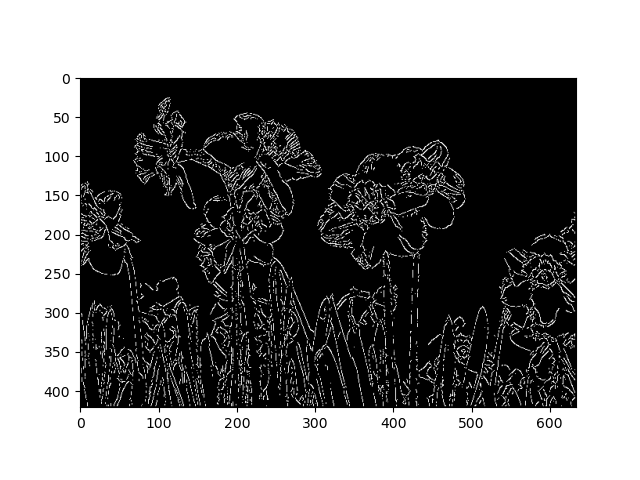
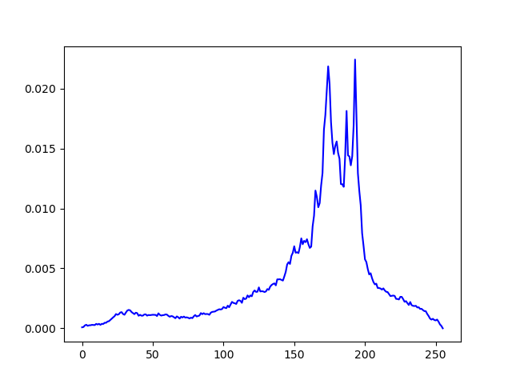
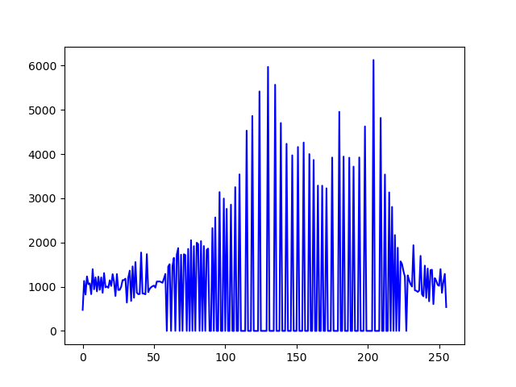
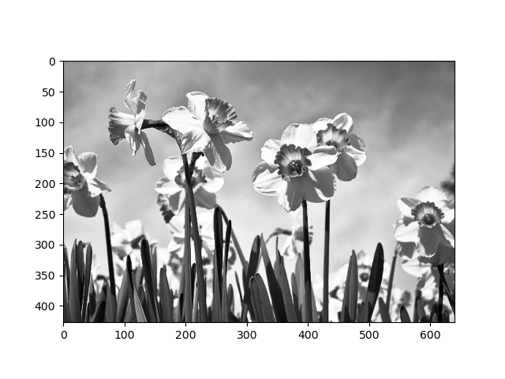
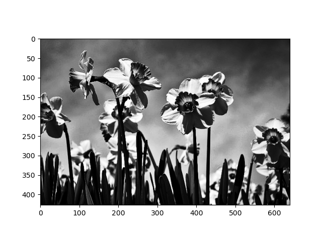
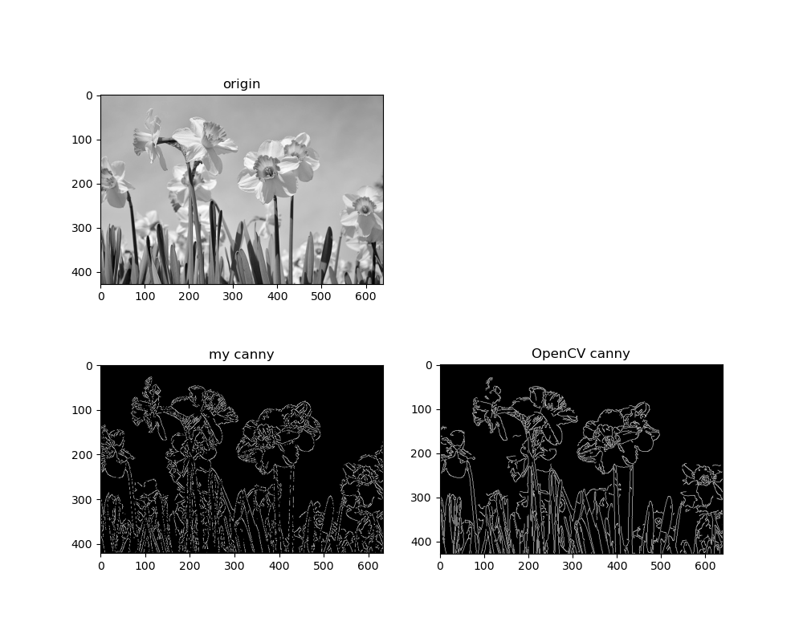

#### 1.环境 

| python | numpy  | opencv-python |
| :----: | ------ | ------------- |
| 3.9.7  | 1.23.2 | 4.5.5         |

运行下列语句

```shell
python main.py
```

#### 2.输入输出

**输入**

单张图像


**输出**

边缘分割后的结果



#### 3.结果分析

- 首先，对图像进行灰度化处理

- 其次，对灰度图进行直方均衡化和gamma矫正处理 

  + 均衡化前后的直方图结果分别如下：

    

    

  + gamma矫正时选取参数分别为 $1.5和\frac{1}{1.5}$，分别得到的图片图下所示：

    

    

- 经历 去噪，计算梯度赋值，非极大值抑制，双阈值检测这几个步骤，完成边缘检测

- 调用Open CV库函数进行对比：

  
  
  
