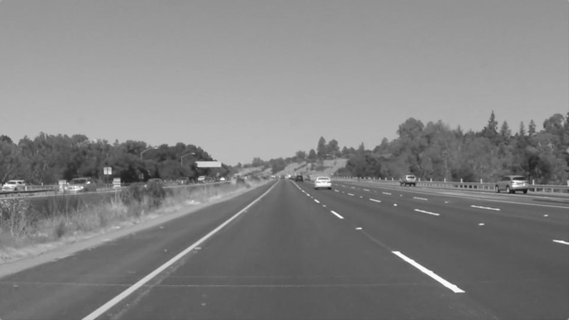

## 环境 
python 3.9.7
## 输入输出
1. 输入540*960 的彩色图片
   
2. 直接将彩色图片传入，进行高斯滤波
   
3. 将原图像进行灰度处理
   
4. 处理后再次进行高斯滤波
  
## 结果分析
编写了n*n，方差为d的高斯核生成函数，并针对彩色图像和灰度图像进行滤波处理，结果如上所示。

初始时 n = 3, d = 1.5

现在固定方差，增大n，令n = 5,并对彩色图像进行滤波，结果如下所示：


然后固定n，增大d，令d = 10，结果如下：


可见，当sigma增大时，图像平滑效果更加明显

调用库函数，得到了类似的结果
```python
cv2.GaussianBlur(img, (size, size), sigma)
```