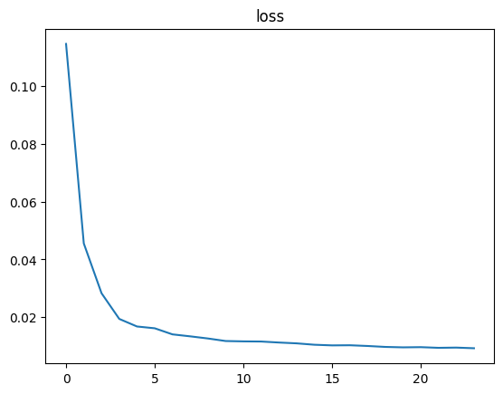
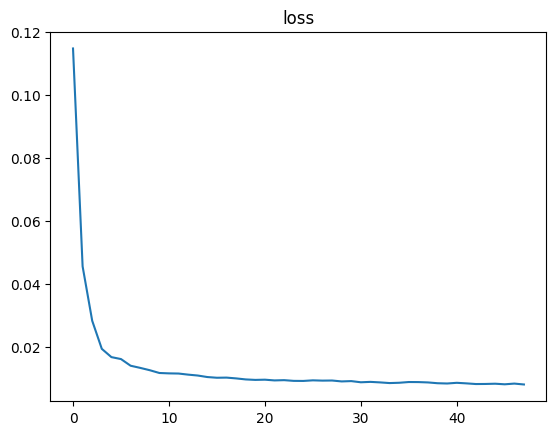
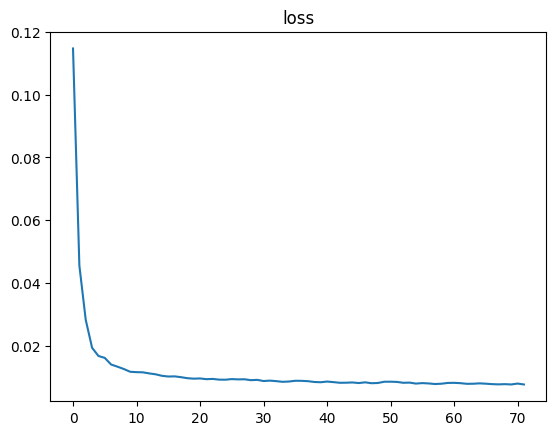
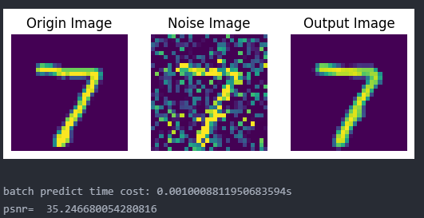

#### 1.环境 

| python | numpy  | torch  |
| :----: | ------ | ------ |
| 3.9.7  | 1.23.2 | 1.21.1 |

#### 2.输入输出

使用$MNIST$数据集，数据为28*28的灰度图像。

首先构造网络，从1通道变成64通道，然后变成128通道；使用$Relu$函数激活。

```python
        # 编码
        self.encoder = nn.Sequential(
            nn.Conv2d(1, 64, kernel_size=3, stride=1, padding=1),
            nn.ReLU(),
            nn.MaxPool2d(kernel_size=2, stride=2),

            nn.Conv2d(64, 128, kernel_size=3, stride=1, padding=1),
            nn.ReLU()
        )
        # 解码
        self.decoder = nn.Sequential(

            nn.Conv2d(128, 64, kernel_size=3, stride=1, padding=1),
            nn.ReLU(),
            nn.Upsample(scale_factor=2, mode="nearest"),

            nn.Conv2d(64, 1, kernel_size=3, stride=1, padding=1),
            nn.ReLU()
        ) 
```

**数据预处理**

给原始图像手动添加高斯噪声，生成服从标准正态分布的随机数，最后进行归一化

```python
torch.clamp(origin_x + torch.randn(60000, 28, 28) * 100, 0, 255) / 255.
```

**训练**

训练时，针对60000个数据，初始参数batch_size = 512，即会进行118次，指定epochs = 3。

训练完成后，将模型文件保存，后续进行测试时可以直接使用模型参数文件，无需训练。

**测试**

模型输入添加高斯噪声后的图像，然后输出去噪后的图像。使用$PSNR$参数衡量去噪效果。

```python
def psnr(im1, im2):
    return 10*np.log10(255*255/np.mean(np.square(im1 - im2)))
```

#### 3.结果分析

使用均方误差损失函数

```python
self.loss_fn = nn.MSELoss()
```

epoch1，epoch2，epoch3 的loss图像分别如图：







去噪效果



如上图所示，计算后的$PSNR$值约为35，表示去噪效果良好。
